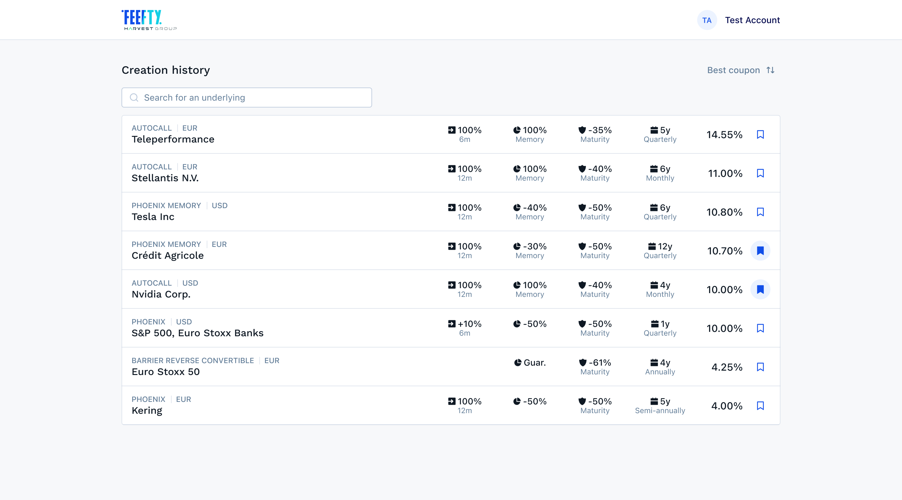

# Product List - React Frontend

This is a frontend technical assessment to evaluate React development skills through building an interactive product creation history list similar to Feefty App.



## Overview

Build a responsive React application that displays a "Creation history" list of products.

The list includes features such as search, sorting, and favorites management. 
The application should handle real-world challenges like partial GraphQL errors, optimistic UI updates,  provide excellent user experience across desktop and mobile devices while respecting the design as close as possible.

## Objectives

**Primary Goal**: Create a React app that renders the "Creation history" list matching the provided Figma designs for both desktop (≥1200px) and mobile (375px) viewports.

**Features**:
- Interactive product list with underlyings search and sorting capabilities (Coupon or Protection)
- Robust error handling for partial GraphQL responses
- Toggle favorites with optimistic UI and error handling
- Accessible interface 

### Time Management
- **Timebox**: 3-5 hours maximum

We value well-implemented features over feature breadth: finish fewer things well rather than shipping everything unfinished.

If time runs out: 
- prioritize features in the following order:
    1. List display
    2. Responsive design
    3. Favorites interaction
    4. Sort list by coupon or protection
    5. Search underlyings
- document remaining work and cutlines.

## Setup 

### Data & API
- **GraphQL Server**: Pre-configured server available in `/server` directory
- **Available Queries**:
  - `products(sort, search)` - Fetch products with optional sorting and search
  - `toggleFavorite(id)` - Toggle favorite status for a product
- **GraphQL interface**: An [GraphiQL](https://www.npmjs.com/package/graphiql) Interface is available on http://localhost:4000/graphql 
- **Test Mode**: the server support an environment variable `TEST_MODE` which adds random delays and occasional partial errors in order to test error handling. It is not activated by default. To activate, add `TEST_MODE = "1"` to your environment (.env file is supported)

To install and start the server:

   ```bash
   cd server
   npm install
   npm start
   ```


## Submission

- Create a private repository using this template ( [Creating a repository from a template](https://docs.github.com/en/repositories/creating-and-managing-repositories/creating-a-repository-from-a-template) )
- Implement the solution
- Include a README with decisions, trade-offs, tests and setup instructions
- Invite your Feefty contacts to the private repository

## Design Reference

Refer to the provided [Figma design](https://www.figma.com/design/d6awJ3rO9vD3Alpo0ggzRE/Frontend-UI-test?node-id=0-1&m=dev&t=YchrpTvvNdyen35q-1) for exact visual specifications:
https://www.figma.com/design/d6awJ3rO9vD3Alpo0ggzRE/Frontend-UI-test?node-id=0-1&m=dev&t=YchrpTvvNdyen35q-1


## Evaluation Checklist
- State Management
- Error handling
- Optimistic UI and Fallback
- Accessibility
- Design fidelity
- Usability
- Test coverage
- Performance
- Documentation
